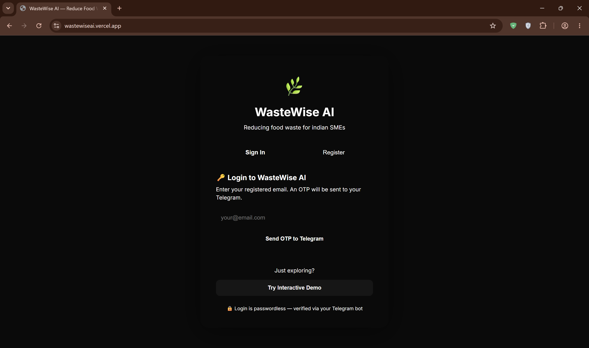
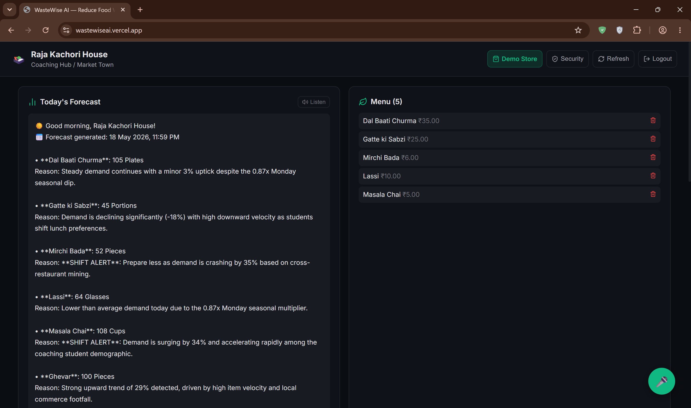
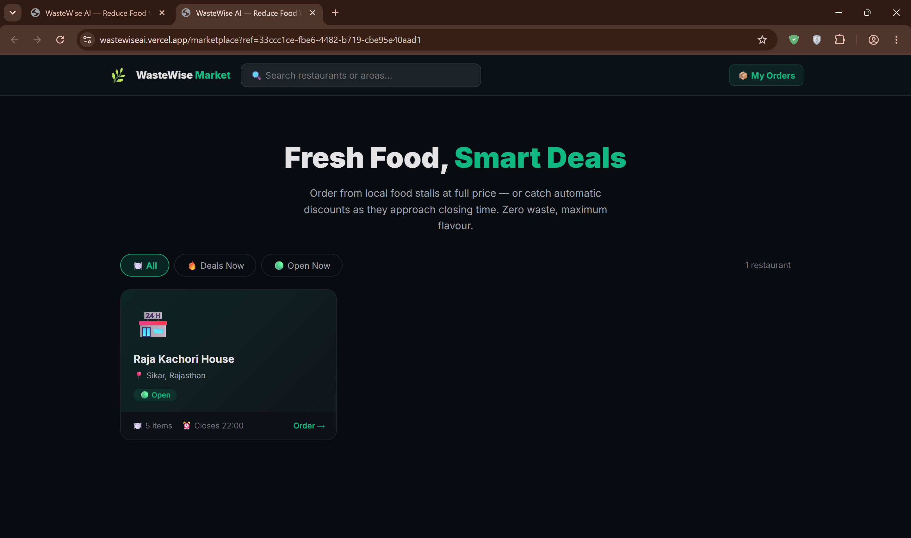

# 🌿 WasteWise AI

> **Autonomous AI platform that eliminates food waste for Indian food vendors and SMEs — all through Telegram.**

[](https://fastapi.tiangolo.com)
[](https://nextjs.org)
[](https://python.org)
[](https://supabase.com)
[](LICENSE)

**[Live App](https://wastewiseai.vercel.app)** · **[GitHub](https://github.com/meel-ayush/WasteWise-AI)** · **[LinkedIn](https://www.linkedin.com/in/ayushmeel)**

---

## 📌 Table of Contents

1. [The Problem](#-the-problem)
2. [My Solution](#-my-solution)
3. [Screenshots](#-screenshots)
4. [Architecture](#-architecture)
5. [Features](#-features)
6. [Tech Stack](#-tech-stack)
7. [Project Structure](#-project-structure)
8. [Getting Started](#-getting-started)
9. [Deployment](#-deployment)
10. [Free-Tier Notes](#-free-tier-notes)
11. [Work in Progress](#-work-in-progress)
12. [Challenges](#-challenges)
13. [What I Learned](#-what-i-learned)
14. [Future Goals](#-future-goals)
15. [License](#-license)

---

## 🚨 The Problem

India generates over **68.7 million tonnes** of food waste annually. A significant share comes from street food vendors, dhabas, and small food stalls — operators who manually estimate daily prep quantities with zero data. When rain reduces foot traffic, festivals shift demand, or a local event draws unexpected crowds, vendors only find out when food is already wasted at closing time.

No existing tool was built for someone too busy cooking to open a dashboard.

---

## 💡 My Solution

WasteWise AI meets vendors where they already are — **Telegram**. One daily message ("30 pyaaz kachori bik gaye aaj") triggers everything else autonomously:

- **Learns** sales patterns with Holt-Winters ML forecasting
- **Forecasts** tomorrow's demand per item, up to 95% accuracy
- **Adjusts prices autonomously** every 15 minutes based on real-time weather, inventory pressure, and time-to-closing — no human input needed
- **Lists excess stock** on a public customer marketplace, turning closing waste into revenue
- **Communicates** in Hindi, English, and regional Indian languages — auto-detected per user

The dashboard provides deeper analytics for owners who want them. The core loop runs entirely through Telegram.

---

## 📸 Screenshots

### Login

*Passwordless OTP authentication with GDPR cookie consent — verified via Telegram*

### Dashboard

*Daily waste metrics, demand forecasts, AI insights with causal root-cause analysis, BCG menu matrix, and voice TTS readout*

### Marketplace

*Public-facing storefront with urgency badges, multi-restaurant cart, and real-time order tracking*

---

## 🏗️ Architecture

```
┌──────────────────────────────────────────────────────────────┐
│               VENDOR  (Telegram Bot)                         │
│   Daily log → NLP intent parse → AI learns → Forecast        │
└──────────────────────┬───────────────────────────────────────┘
                       │  message (webhook)
              ┌────────▼────────┐
              │  Telegram Bridge│  ← Render (always-on relay)
              │  (FastAPI)      │    Receives Telegram webhooks,
              │                 │    forwards to HF backend,
              └────────┬────────┘    sends replies back to Telegram
                       │  internal HTTP (X-Internal-Secret)
┌──────────────────────▼──────────────────────────────────────┐
│           FastAPI Backend  (Python 3.12 · Uvicorn)           │
│                   Hugging Face Spaces                         │
│                                                              │
│   NLP Engine (20+ intents)  ·  Autonomous Pricing Agent      │
│   Scheduler (6 background jobs)  ·  Security Layer           │
│   Causal AI  ·  Menu Engineering  ·  Marketplace             │
└──────┬───────────────────────────────────────┬──────────────┘
       │                                       │
┌──────▼──────────┐                 ┌──────────▼──────────┐
│  Supabase       │                 │  Redis  (Upstash)   │
│  PostgreSQL     │◄───────────────►│  TTL cache          │
│  16 tables      │                 │  in-memory fallback │
│  + local JSON   │                 └─────────────────────┘
│  fallback       │
└──────┬──────────┘
       │
┌──────▼──────────────────────────────────────────────────────┐
│  AI Fallback Chain — never fails on a single outage          │
│  Gemini 2.5 Flash  →  Groq (Llama 3.3)  →  Mistral Small    │
└─────────────────────────────────────────────────────────────┘

┌─────────────────────────────────────────────────────────────┐
│          Next.js 15 Dashboard  (TypeScript · Vercel)         │
│  Upload · Events · Profit · Marketplace · Insights · CV      │
└─────────────────────────────────────────────────────────────┘
```

**Why a separate Telegram Bridge?**
Hugging Face Spaces cannot receive inbound TCP connections directly from Telegram. The bridge (hosted on Render, which supports persistent inbound webhooks) acts as a relay: it receives Telegram webhook calls and forwards them to the HF backend via an authenticated internal HTTP request.

---

## ✨ Features

### ✅ Live in Dashboard + Telegram

| Feature | Detail |
|---|---|
| 🤖 **Demand Forecasting** | Holt-Winters + ensemble ML, up to 95% accuracy, weekly auto-retraining |
| ⚡ **Autonomous Pricing Agent** | Runs every 15 min (6 AM–11 PM) — adjusts discounts from 10 factors: weather, inventory, closing urgency, day-of-week, events, and more |
| 🛒 **Closing Stock Marketplace** | Customers browse discounted items → order → Telegram alert to vendor → 45-min pickup window |
| 📦 **Daily Order Numbers** | Each order gets a short daily #N reset at midnight — vendor replies `done 3` or `miss 3` |
| 📊 **Orders Dashboard Panel** | Real-time view of today's pending/completed/cancelled orders with status controls |
| 🔗 **Chain Management Panel** | Create chains, add/remove branches, push menu templates — with Telegram primary approval for destructive actions |
| 🔬 **Causal AI Root-Cause** | SCM + ITS + Bayesian ATT explains *why* yesterday underperformed (rain / day-of-week / events / unexplained residual) |
| 📊 **BCG Menu Engineering** | Stars / Ploughhorses / Puzzles / Dogs matrix with HHI concentration and cannibalization detection |
| 📷 **Computer Vision Inventory** | Upload a shelf photo — Gemini Vision + EasyOCR detects ingredients and cross-references your BOM |
| 🧾 **Shopping List** | Auto-generated daily from tomorrow's forecast — shows exactly what to buy and how much |
| 🔊 **Voice TTS Insights** | Reads causal + menu analysis aloud via Web Speech API. No library or API key needed |
| 🧠 **Multi-Intent NLP** | One Telegram message can contain multiple commands — all executed in a single reply |
| 🗓️ **Event Registration** | Log upcoming events (melas, market days, cricket finals) so AI adjusts forecasts proactively |

### 🔐 Security & Administration

| Feature | Detail |
|---|---|
| 🔑 **Primary Account Model** | One Telegram account is designated Primary per restaurant — only they can approve destructive actions |
| 📱 **Inline Session Management** | Telegram bot shows all logged-in devices with ⭐ Make Primary and 🗑 Remove buttons |
| ✅ **Dashboard Action Approval** | Delete restaurant, delete chain, add/remove branch — all require Primary Telegram confirmation |
| 🛡️ **OTP Rate Limiting** | Failed OTP attempts tracked and blocked — no brute-force possible |
| 🔒 **Input Sanitisation** | All user inputs validated + sanitised before DB writes |
| 📝 **Full Audit Trail** | Every write operation logged with timestamp, email, endpoint, and IP address |

---

## 🛠️ Tech Stack

**Backend** — Python 3.12 · FastAPI · Uvicorn · Supabase (PostgreSQL) · Redis (Upstash) · APScheduler · scikit-learn · NumPy · Gemini 2.5 Flash / Groq / Mistral · EasyOCR · Pillow · SlowAPI · Open-Meteo · Aladhan · LocationIQ / Nominatim

**Bridge** — Python 3.12 · FastAPI · httpx · Render

**Frontend** — Next.js 15 (App Router) · TypeScript · React hooks · Web Speech API (TTS + voice input)

---

## 📁 Project Structure

```
WasteWise-AI/
│
├── README.md                            ← This file
├── LICENSE                              ← CC BY-NC 4.0
│
├── docs/
│   └── supabase_schema.sql              ← Full PostgreSQL schema — run once in Supabase SQL Editor
│
├── screenshots/
│   ├── login.png                        ← Login UI showcasing the web dashboard
│   ├── dashboard.png                    ← Main store owner dashboard view
│   └── marketplace.png                  ← Public marketplace for discounted food
│
├── backend/                             ← FastAPI server — deploy to Hugging Face Spaces
│   ├── main.py                          ← App entry point — 50+ API routes
│   ├── requirements.txt                 ← All Python dependencies (pinned versions)
│   ├── .env.example                     ← Template for every environment variable
│   └── services/
│       ├── ai_provider.py               ← Gemini → Groq → Mistral 3-tier fallback chain
│       ├── audit.py                     ← Request / response audit middleware
│       ├── auth.py                      ← OTP issuance, session management, primary account logic
│       ├── bom_ai.py                    ← Bill-of-Materials AI generator
│       ├── cache.py                     ← Cache invalidation helpers
│       ├── cache_layer.py               ← Unified Redis ↔ memory cache interface
│       ├── causal_ai.py                 ← SCM + ITS + Bayesian ATT causal inference engine
│       ├── chain_management.py          ← Multi-branch chain creation, analytics, transfer logic
│       ├── computer_vision_inventory.py ← Gemini Vision + EasyOCR shelf-photo scanning
│       ├── data_miner.py                ← Holt-Winters forecasting, waste metrics, BOM
│       ├── email_service.py             ← Resend transactional email for OTP delivery
│       ├── federated_learning.py        ← 2-layer MLP + FedAvg + Laplace differential privacy
│       ├── file_processor.py            ← PDF / DOCX / XLSX upload and text extraction
│       ├── gamification.py              ← Streak tracking, badges, regional leaderboard logic
│       ├── india_context.py             ← India-specific: prayer times, regional intelligence
│       ├── inventory.py                 ← Marketplace listings, surge pricing, order lifecycle
│       ├── location_intel.py            ← Geocoding, foot-traffic analysis, weather fetch
│       ├── marketplace_auth.py          ← Customer-facing OTP auth for order tracking
│       ├── menu_engineering.py          ← BCG matrix, HHI, cannibalization detection
│       ├── migrations.py                ← Database schema migration runner
│       ├── nlp.py                       ← Multi-intent NLP engine, 20+ intents, multilingual
│       ├── pricing_agent.py             ← Autonomous 15-min pricing intelligence agent
│       ├── scheduler.py                 ← 6 background jobs (closing alerts, pricing, autotuning)
│       ├── security.py                  ← Auth guards, IDOR prevention, rate limiting
│       ├── send_queue.py                ← Telegram message send queue with dedup
│       ├── sse_broadcaster.py           ← Server-Sent Events for dashboard live updates
│       ├── storage_service.py           ← Supabase Storage bucket manager
│       ├── supabase_db.py               ← Supabase + local JSON hybrid DB layer
│       ├── sustainability.py            ← Carbon footprint scoring, CO₂ equivalence
│       ├── task_queue.py                ← APScheduler task dispatcher
│       ├── telegram_bot.py              ← Complete Telegram bot handler
│       ├── tg_http.py                   ← Async httpx client for Telegram API
│       └── __init__.py                  ← Package initialization
│
├── telegram-bridge/                     ← Telegram relay — deploy to Render
│   ├── main.py                          ← Webhook receiver + HF backend forwarder
│   ├── requirements.txt                 ← Python dependencies for the bridge
│   └── .env.example                     ← Template for bridge environment variables
│
└── frontend/                            ← Next.js 15 frontend — deploy to Vercel
    ├── .env.example                     ← Template for frontend environment variables
    ├── package.json                     ← NPM dependencies and build scripts
    ├── next.config.ts                   ← Next.js framework configuration
    ├── tsconfig.json                    ← TypeScript compiler configuration
    └── src/app/
        ├── globals.css                  ← Global Tailwind CSS styles and theme variables
        ├── layout.tsx                   ← Root HTML layout and global providers
        ├── page.tsx                     ← Entry point — auth routing + 30-day cookie session
        ├── components/
        │   ├── AuthScreen.tsx           ← Login / register screen toggle
        │   ├── ChainsPanel.tsx          ← Chain management panel
        │   ├── Dashboard.tsx            ← Main owner dashboard
        │   ├── FileIntentModal.tsx      ← Intent chooser after file upload
        │   ├── LoginFlow.tsx            ← Email OTP login flow
        │   ├── Modal.tsx                ← Reusable modal component
        │   ├── OrdersPanel.tsx          ← Real-time orders with status management
        │   ├── ProfitTab.tsx            ← Sales & profit breakdown
        │   ├── RegisterFlow.tsx         ← Multi-step registration
        │   ├── StoreSettings.tsx        ← Marketplace listings, closing time
        │   └── VoicePanel.tsx           ← Floating voice input + TTS
        ├── customer/
        │   └── page.tsx                 ← Customer order tracking page
        └── marketplace/
            └── page.tsx                 ← Public marketplace storefront
```

---

## 🚀 Getting Started

### Prerequisites

- Python 3.12+ · Node.js 18+ · Git
- Free accounts at: [Supabase](https://supabase.com) · [Telegram](https://t.me/BotFather) · [Google AI Studio](https://aistudio.google.com)

---

### Step 1 — Clone

```bash
git clone https://github.com/meel-ayush/WasteWise-AI.git
cd WasteWise-AI
```

---

### Step 2 — Database Setup

1. Go to [supabase.com](https://supabase.com) → **New Project** → name it `wastewise`, region: Mumbai / Singapore.
2. **SQL Editor** → paste the full contents of `docs/supabase_schema.sql` → **Run**.
3. **Settings → API** → copy:
   - **Project URL** → `SUPABASE_URL`
   - **`service_role` key** → `SUPABASE_SERVICE_KEY`

> ⚠️ The `service_role` key has full database access. Never put it in the frontend or commit it to Git.

---

### Step 3 — Telegram Bot Setup

1. Open Telegram → search `@BotFather` → send `/newbot`
2. Follow the prompts → copy the **bot token** → `TELEGRAM_TOKEN`
3. Copy the **bot username** (without `@`) → `BOT_USERNAME`

---

### Step 4 — Obtain All API Keys

| Variable | Where to get it | Required? |
|---|---|:---:|
| `SECRET_KEY` | `python -c "import secrets; print(secrets.token_urlsafe(64))"` | ✅ |
| `TELEGRAM_TOKEN` | [@BotFather](https://t.me/BotFather) → `/newbot` | ✅ |
| `BOT_USERNAME` | Your bot's username from BotFather | ✅ |
| `SUPABASE_URL` | Supabase → Settings → API | ✅ |
| `SUPABASE_SERVICE_KEY` | Supabase → Settings → API → `service_role` | ✅ |
| `GEMINI_API_KEY` | [aistudio.google.com](https://aistudio.google.com) → Get API Key | ✅ |
| `ALLOWED_ORIGINS` | Your Vercel dashboard URL, e.g. `https://my-app.vercel.app` | ✅ |
| `BRIDGE_URL` | Your Render bridge URL, e.g. `https://wastewise-bridge.onrender.com` | ✅ |
| `INTERNAL_SECRET` | `python -c "import secrets; print(secrets.token_hex(32))"` | ✅ |
| `WEBHOOK_SECRET` | `python -c "import secrets; print(secrets.token_hex(32))"` | ✅ |
| `ADMIN_EMAIL` | Your admin email | Recommended |
| `RESEND_API_KEY` | [resend.com](https://resend.com) → API Keys | Recommended |
| `FROM_EMAIL` | Verified sender address on Resend | Recommended |
| `GROQ_API_KEY` | [console.groq.com](https://console.groq.com) → API Keys | Recommended |
| `MISTRAL_API_KEY` | [console.mistral.ai](https://console.mistral.ai) → API Keys | Recommended |
| `REDIS_URL` | [upstash.com](https://upstash.com) → Create Database → copy `rediss://` URL | Optional |
| `CELERY_BROKER_URL` | Same Upstash URL with `/0` suffix | Optional |
| `CELERY_RESULT_BACKEND` | Same Upstash URL with `/0` suffix | Optional |
| `LOCATIONIQ_API_KEY` | [locationiq.com](https://locationiq.com) → Access Tokens | Optional |
| `GEOAPIFY_API_KEY` | [geoapify.com](https://geoapify.com) → Projects → API Key | Optional |

---

### Step 5 — Configure Environment Variables

```bash
# Backend
cd backend
cp .env.example .env
# Fill in your keys

# Bridge
cd ../bridge
cp .env.example .env
# Fill in TELEGRAM_TOKEN, WEBHOOK_SECRET, HF_BACKEND_URL, INTERNAL_SECRET, BOT_USERNAME

# Frontend
cd ../dashboard
cp .env.example .env.local
# Set NEXT_PUBLIC_API_URL to your HF Space URL or http://localhost:8000
```

---

### Step 6 — Run Locally

```bash
# Terminal 1 — Backend
cd backend
pip install -r requirements.txt
uvicorn main:app --reload --port 8000

# Terminal 2 — Bridge (optional for local testing)
cd bridge
pip install -r requirements.txt
uvicorn main:app --reload --port 8001

# Terminal 3 — Frontend
cd dashboard
npm install
npm run dev
# Dashboard → http://localhost:3000
```

> **Local Telegram testing:** Telegram cannot reach `localhost`. Use [ngrok](https://ngrok.com): run `ngrok http 8001`, then register your bridge's ngrok URL as the Telegram webhook (see Step 7).

---

### Step 7 — Register Telegram Webhook

After deploying the bridge to Render, register it as the Telegram webhook:

```
https://api.telegram.org/bot<TELEGRAM_TOKEN>/setWebhook?url=<BRIDGE_URL>/webhook&secret_token=<WEBHOOK_SECRET>
```

Open this URL in a browser. You should see `{"ok":true,"result":true}`.

> `WEBHOOK_SECRET` must be 1-256 chars, alphanumeric + underscores only.

---

## 🌐 Deployment

### Bridge → Render

The bridge **must be deployed first** — you need its URL to configure the backend.

1. Push the repo to GitHub.
2. [render.com](https://render.com) → **New Web Service** → connect repo → set **Root Directory** to `bridge`.
3. Build command: `pip install -r requirements.txt`
4. Start command: `uvicorn main:app --host 0.0.0.0 --port 10000`
5. Add environment variables from `bridge/.env.example`.
6. Deploy → copy the URL (e.g. `https://wastewise-bridge.onrender.com`) → this is your `BRIDGE_URL`.

### Backend → Hugging Face Spaces

1. [huggingface.co](https://huggingface.co) → **Spaces → New Space** → SDK: **Gradio / FastAPI** → name: `wastewise-backend`.
2. Push the `backend/` folder to the Space:
   ```bash
   git remote add hf https://huggingface.co/spaces/YOUR_HF_USERNAME/wastewise-backend
   git subtree push --prefix backend hf main
   ```
3. **Settings → Variables and secrets** → add all keys from `backend/.env.example`.
4. Hugging Face reads `requirements.txt` and starts the app from `main.py` automatically.

### Frontend → Vercel

1. [vercel.com](https://vercel.com) → **New Project** → import repo → set **Root Directory** to `frontend`.
2. Add environment variable:
   ```
   NEXT_PUBLIC_API_URL = https://YOUR_HF_USERNAME-wastewise-backend.hf.space
   ```
3. Click **Deploy**.

### Keep-Alive *(prevents free-tier sleep)*

Hugging Face Spaces sleep after 48 hours of inactivity. Supabase pauses after 7 days.

1. [cron-job.org](https://cron-job.org) → **Create Cronjob**
2. URL: `https://YOUR_HF_USERNAME-wastewise-backend.hf.space/api/health`
3. Schedule: `0 */12 * * *` (every 12 hours)

The `/api/health` endpoint runs a Supabase query on every call — one monitor keeps both services alive.

---

## ⚠️ Free-Tier Notes

| Service | Limitation | Behaviour |
|---|---|---|
| **Supabase** | Pauses after 7 days inactive | Keep-alive cron above fixes this |
| **Hugging Face** | Sleeps after 48 h inactive | Same cron fixes this |
| **Render** | Spins down after 15 min inactive (free) | Bridge cold starts in ~30s |
| **Upstash Redis** | Free plan: database `/0` only | Use `/0` suffix on all Redis URLs |
| **Gemini** | 15 req/min · 1,500/day | 3-tier AI fallback handles this |
| **Resend** | 100 emails/day · 3,000/month | Only for OTP — unlikely to hit |
| **LocationIQ** | 5,000 req/day | Auto-fallback to Nominatim (no key) |

---

## 🚧 Work in Progress

These features are **fully implemented in the backend and Telegram bot** but do not yet have a dashboard UI.

| Feature | Current Access | Status |
|---|---|---|
| 🎮 **Gamification** — streaks, badges, milestones | Telegram bot — after each daily log | Dashboard widget coming |
| 🏆 **Regional Leaderboard** — weekly waste ranking | Telegram bot — Sunday briefing | Dashboard page coming |
| 🌿 **Sustainability Tracking** — CO₂ saved | Telegram bot — monthly summary | Dashboard tab coming |
| 🧬 **Federated Learning** — cross-restaurant ML | Admin API endpoint | Automated scheduling coming |
| 🧾 **BOM Detail Editor** — costs, suppliers | Telegram bot commands | Dashboard UI coming |

---

## 🧗 Challenges

- **Making AI act, not just recommend.** The pricing agent applies real discounts autonomously. Earning user trust required anti-thrash cooldowns and Telegram notifications that kept owners informed without overwhelming them.
- **Designing for non-tech users.** The entire AI loop had to work through a single Telegram message. This drove multi-intent NLP with Hindi / English code-switching tolerance.
- **The HF + Telegram architecture problem.** Hugging Face Spaces cannot receive inbound connections from Telegram. The two-service architecture (Bridge on Render + Backend on HF) was the minimal viable solution.
- **Zero-downtime on free infrastructure.** HF, Supabase, and Upstash each have different inactivity thresholds. One `/api/health` endpoint exercises all three dependencies on every call.
- **IDOR prevention across 19 endpoints.** `require_restaurant_access()` is now the first guard on every multi-tenant endpoint — a lesson learned the hard way retrofitting it.

---

## 📚 What I Learned

- **LLMs as decision engines.** The pricing agent produces structured JSON that modifies real database values — not text. The engineering is in the validation loop around the call.
- **Product constraints drive better architecture.** "Telegram-only primary interface" forced cleaner decisions than a generic dashboard would have.
- **Causal inference makes analytics actionable.** "Sales dropped 18% because of rain (p < 0.05)" is a decision. "Sales dropped 18%" is noise.
- **Free infrastructure is viable if you design for failure.** Every dependency has a fallback. Resilience is a design layer.
- **Two-service relay architecture for webhook constraints.** When your compute host can't receive inbound connections, a lightweight relay on a host that can is a clean, production-viable solution.

---

## 🔭 Future Goals

- [ ] **WhatsApp Business API** — second primary interface alongside Telegram
- [ ] **Dashboard UI for all WIP features** — gamification, leaderboard, sustainability, BOM editor
- [ ] **PWA + offline mode** — log sales without internet, sync on reconnect
- [ ] **Integrated payment gateway** — direct checkout in marketplace
- [ ] **Voice-first mobile UX** — speak to log, hear the forecast back
- [ ] **Telegram Mini App** — native card UI within Telegram on iOS/Android

---

## 🌐 APIs & Services Used

| Service | Purpose | Key needed? |
|---|---|:---:|
| [Supabase](https://supabase.com) | PostgreSQL database + File Storage | ✅ Free |
| [Telegram Bot API](https://core.telegram.org/bots/api) | Primary vendor interface | ✅ Free |
| [Gemini 2.5 Flash](https://aistudio.google.com) | Primary AI model | ✅ Free |
| [Groq](https://console.groq.com) | AI fallback tier 2 | ✅ Free |
| [Mistral](https://console.mistral.ai) | AI fallback tier 3 | ✅ Free |
| [Resend](https://resend.com) | Transactional email OTP | ✅ Free |
| [Upstash](https://upstash.com) | Redis cache | ✅ Free |
| [Open-Meteo](https://open-meteo.com) | Real-time weather + forecast | ❌ No key |
| [Aladhan](https://aladhan.com) | Prayer times API | ❌ No key |
| [Nominatim](https://nominatim.openstreetmap.org) | Geocoding fallback (OSM) | ❌ No key |
| [LocationIQ](https://locationiq.com) | Precision geocoding | ✅ Free |
| [Geoapify](https://geoapify.com) | Address autocomplete | ✅ Free |
| [cron-job.org](https://cron-job.org) | Keep-alive uptime monitor | ❌ No key |

---

## 📄 License

Licensed under **Creative Commons Attribution-NonCommercial 4.0 International (CC BY-NC 4.0)**.

Free to share and adapt for non-commercial use with attribution. Commercial use requires a separate license — contact via [LinkedIn](https://www.linkedin.com/in/ayushmeel).

Full terms: [LICENSE](LICENSE) · [CC BY-NC 4.0 Legal Code](https://creativecommons.org/licenses/by-nc/4.0/legalcode)

---

## 👤 Author

**Ayush Meel**

[](https://github.com/meel-ayush)
[](https://www.linkedin.com/in/ayushmeel)

---

*Built to make Indian food culture more sustainable, one portion at a time.*
